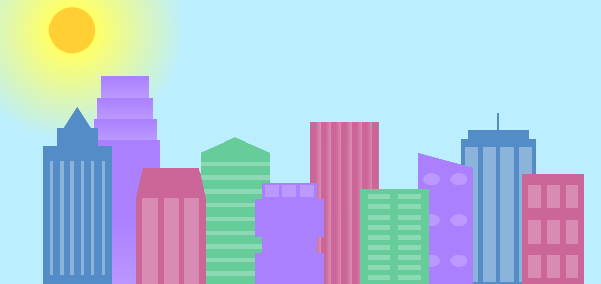
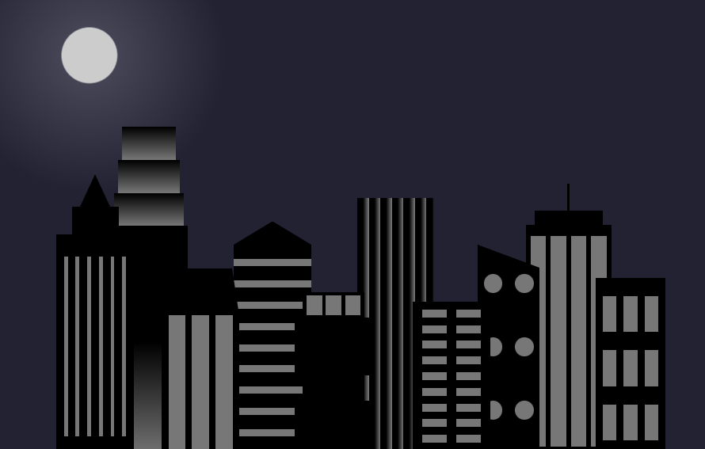

# Building

This project was done purely to upgrade my CSS skills by the help of FreeCodeCamp
----

## Overview

- Html
- CSS

### Html

This code has a series of **div** elements that has each own classes. The **div** elements are divided into:
- building : This represent the buildings in-front
  - building 1, building 2, building 3 and building 4.  
- foreground building : This represent the buildings behind.
  - foreground building 1, foreground building 2, foreground building 3 and foreground building 4.

### CSS

In the CSS, I created a root style to define the color, allowing me to reuse it easily whenever needed.
- building, foreground building
  - With the help of FreeCodeCamp, I styled it in CSS to resemble a realistic building
- The sun was crafted usuing CSS to give it a realistic appearance

---
This was styled to display daylight when maximized and transition to nighttime when minimized.

- Daytime

- Night time
